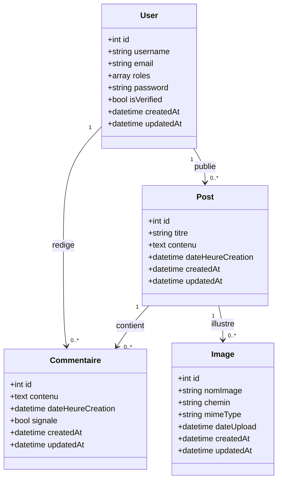

# Diagramme de classe

Le diagramme ci-dessous decrit la solution cible d'apres les entites et relations actuellement implementees dans le projet Symfony.

## Lecture du diagramme

- `User` represente un visiteur inscrit ou un administrateur.
- `Post` represente une actualite publiee sur le site.
- `Commentaire` represente une reaction d'un utilisateur sur une actualite.
- `Image` represente un media associe a une actualite.

## Relations principales

- un utilisateur peut publier plusieurs posts
- un utilisateur peut rediger plusieurs commentaires
- un post peut recevoir plusieurs commentaires
- un post peut contenir plusieurs images

## Remarque

Le projet repose sur quatre entites principales. Les formulaires, controllers et repositories s'appuient sur ce modele pour construire le front office et le backoffice.
